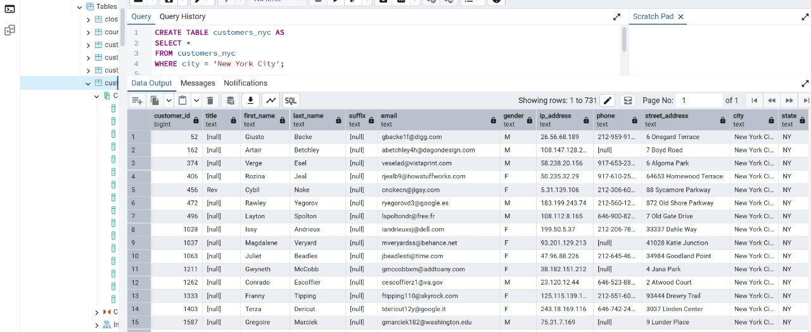
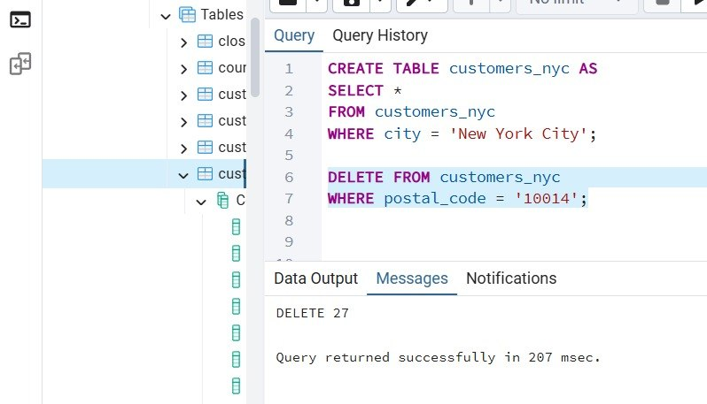
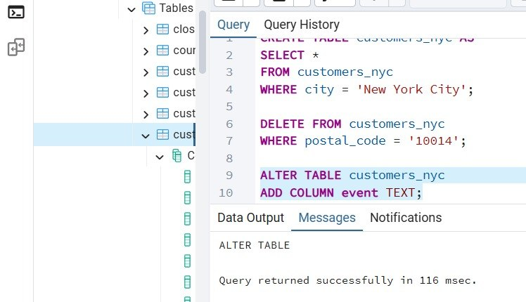
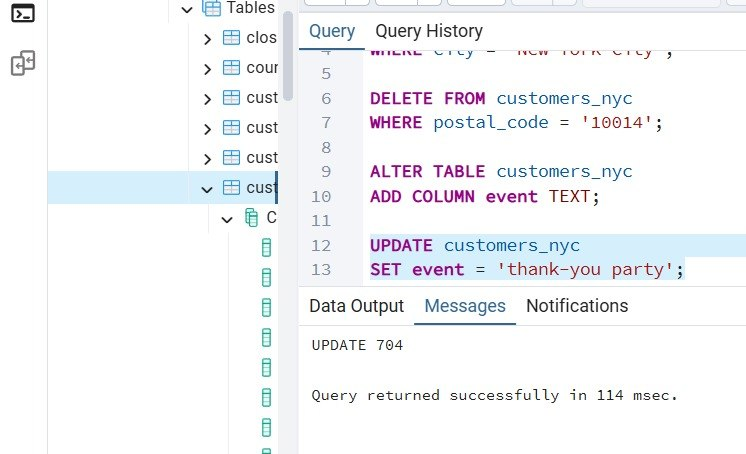
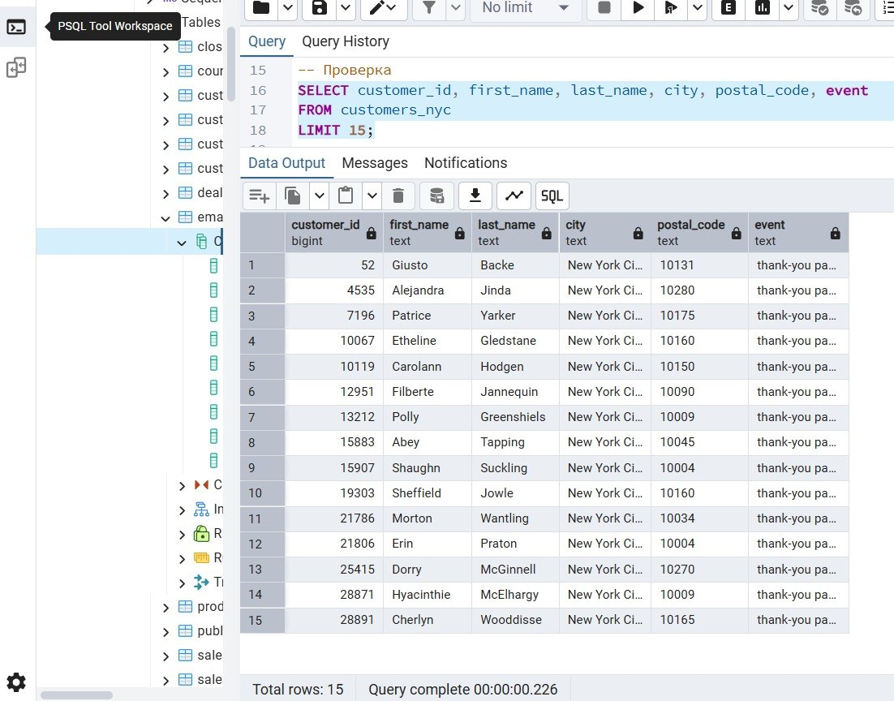
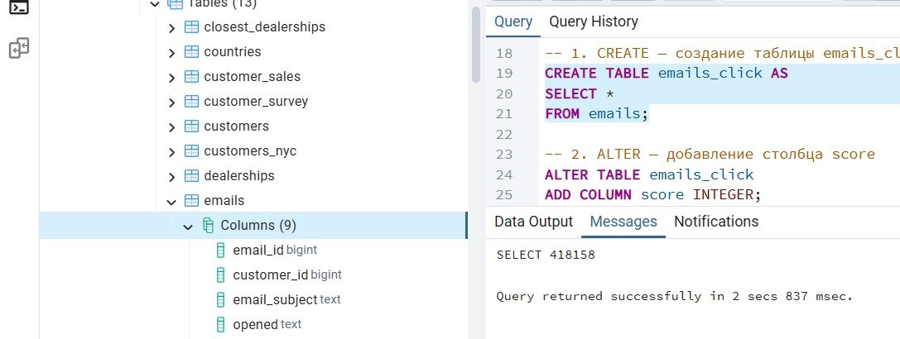
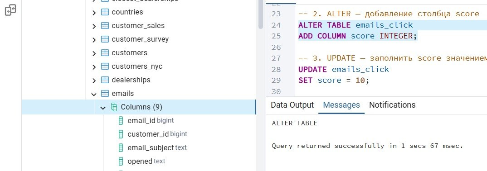
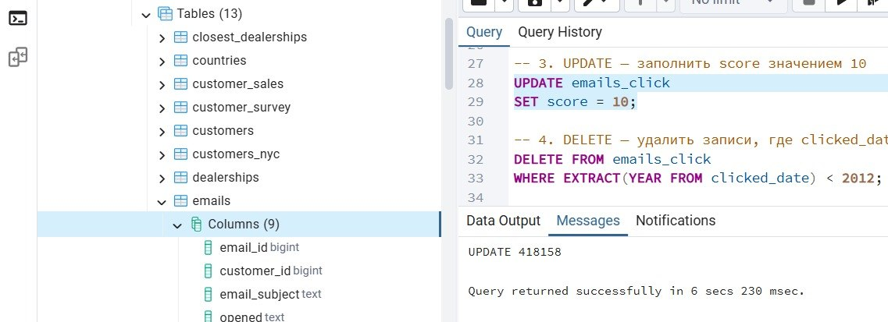
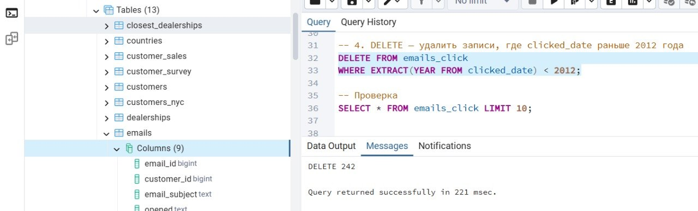
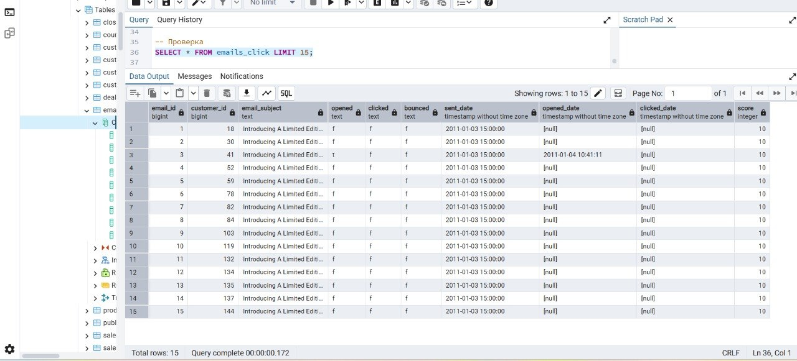

# Лабораторная работа №1. Основы работы с SQL-запросами: выборка и модификация данных

**СУБД:** PostgreSQL  
**Инструментарий:** DBeaver, psql (терминал)  
**Вариант:** 17
**Выполнила:** Софронова Кира

---

## Задания

### 1.1. Базовый поиск (Salespeople)

**Текст задания:**  
Напишите запрос, который выводит username первых 10 нанятых женщин-продавцов. Отсортируйте по дате найма (hire_date) от самой ранней к самой поздней.  
Напишите аналогичный запрос для мужчин-продавцов.

**Код запроса:**
```sql
-- Женщины-продавцы (первые 10 нанятых)
SELECT username, hire_date
FROM salespeople
WHERE gender = 'Female'
ORDER BY hire_date ASC
LIMIT 10;
```

**Результат выполнения:** 


**Код запроса:**

```sql
-- Мужчины-продавцы (первые 10 нанятых)
SELECT username, hire_date
FROM salespeople
WHERE gender = 'Male'
ORDER BY hire_date ASC
LIMIT 10;
```

**Результат выполнения:** 


### 1.2. Работа с клиентами (Customers)

**Текст задания:**

1. Получите все электронные адреса (email) клиентов из штата Флорида (FL), отсортированные в алфавитном порядке.
2. Получите имена, фамилии и email клиентов из города Нью-Йорк (New York City), штат Нью-Йорк (NY). Отсортируйте результат по фамилии, затем по имени.
3. Получите всех клиентов с их номерами телефонов, отсортированных по дате добавления в базу (date_added).

**Код запроса:**

```sql
-- Email клиентов из штата Флорида (FL)
SELECT email
FROM customers
WHERE state = 'FL'
ORDER BY email ASC;
```

**Результат выполнения:**


**Код запроса:**

```sql
-- Клиенты из New York City, NY
SELECT first_name, last_name, email
FROM customers
WHERE city = 'New York City' AND state = 'NY'
ORDER BY last_name ASC, first_name ASC;
```

**Результат выполнения:**


**Код запроса:**

```sql
-- Все клиенты с номерами телефонов, сортировка по дате добавления
SELECT first_name, last_name, phone, date_added
FROM customers
WHERE phone IS NOT NULL
ORDER BY date_added ASC;
```

**Результат выполнения:**


---

### 1.3. Маркетинговые операции (CRUD)

**Текст задания:**

1. Создание. Создайте таблицу customers_rus, скопировав данные клиентов из города New York City (штат NY).
2. Удаление. Удалите из новой таблицы клиентов с индексом 10014.
3. Изменение. Добавьте текстовый столбец event.
4. Обновление. Заполните столбец event значением 'thank-you party'.

**Код запроса:**

```sql
-- 1. Создание таблицы customers_rus
CREATE TABLE customers_rus AS
SELECT *
FROM customers
WHERE city = 'New York City' AND state = 'NY';
```

**Результат выполнения:**



**Код запроса:**

```sql
-- 2. Удаление клиента с индексом 10014
DELETE FROM customers_rus
WHERE postal_code = 10014;
```

**Результат выполнения:**



**Код запроса:**

```sql
-- 3. Добавление текстового столбца event
ALTER TABLE customers_rus
ADD COLUMN event TEXT;
```

**Результат выполнения:**

  

**Код запроса:**

```sql
-- 4. Обновление столбца event
UPDATE customers_rus
SET event = 'thank-you party';
```

**Результат выполнения:**



**Код запроса**

```sql
-- Проверка
SELECT customer_id, first_name, last_name, city, postal_code, event 
FROM customers_nyc 
LIMIT 15;
```

**Результат выполнения:**



---

## Индивидуальные задания (вариант 17)

## Задание 1. Клиенты из города Chicago

**Текст задания:**

Клиенты (customers) из города 'Chicago'. Сортировка: индекс.

**Код запроса:**

```sql
SELECT *
FROM customers
WHERE city = 'Chicago'
ORDER BY index ASC;
```

**Результат выполнения:**


## Задание 2. Продажи с NULL в dealership_id

**Текст задания:**

Продажи (sales) с NULL в поле dealership_id.

**Код запроса:**

```sql
-- Поиск таблицы с колонкой dealership_id
SELECT table_name, column_name
FROM information_schema.columns
WHERE column_name = 'dealership_id';

-- Запрос на основе найденной таблицы (пример для sales_data)
SELECT *
FROM sales_data
WHERE dealership_id IS NULL;
```

**Результат выполнения:**


## Задание 3. Таблица emails_click

**Текст задания:**

Таблица emails_click (письма с кликами). Добавить score=10. Удалить старые (<2012).

**Код запроса:**

```sql
-- Задание 3. Операции CRUD.
-- 1. CREATE — создание таблицы emails_click на основе данных из emails
CREATE TABLE emails_click AS
SELECT *
FROM emails;
```

**Результат выполнения:**



**Код запроса:**

```sql
-- 2. ALTER — добавление столбца score
ALTER TABLE emails_click
ADD COLUMN score INTEGER;
```

**Результат выполнения:**



**Код запроса:**

```sql
-- 3. UPDATE — заполнение score значением 10
UPDATE emails_click
SET score = 10;
```

**Результат выполнения:**



**Код запроса:**

```sql
-- 4. DELETE — удаление записей, где clicked_date раньше 2012 года
DELETE FROM emails_click
WHERE EXTRACT(YEAR FROM clicked_date) < 2012;
```

**Результат выполнения:**



**Код запроса:**

```sql
-- Проверка
SELECT * FROM emails_click LIMIT 15;
```

**Результат выполнения:**



---

### Вывод

В ходе выполнения лабораторной работы были освоены основные операции SQL:

* SELECT — выборка данных с фильтрацией (WHERE), сортировкой (ORDER BY) и ограничением количества записей (LIMIT);
* CREATE TABLE AS — создание таблицы на основе результата выборки;
* DELETE — удаление записей по условию;
* ALTER TABLE — изменение структуры таблицы (добавление столбца);
* UPDATE — обновление данных в таблице.

Работа выполнялась в двух средах: DBeaver (для подключения к основной учебной базе) и psql (для локальной базы данных). Все запросы отработали корректно, результаты соответствуют ожидаемым.
